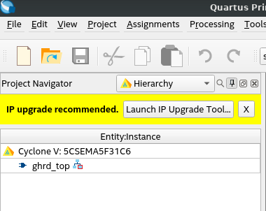
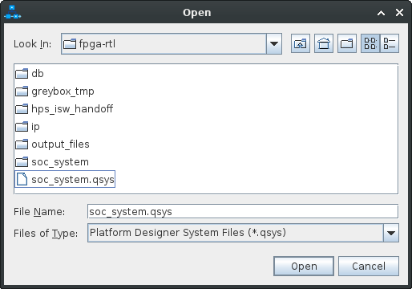
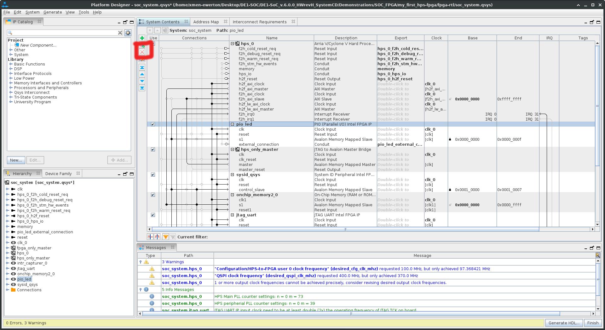
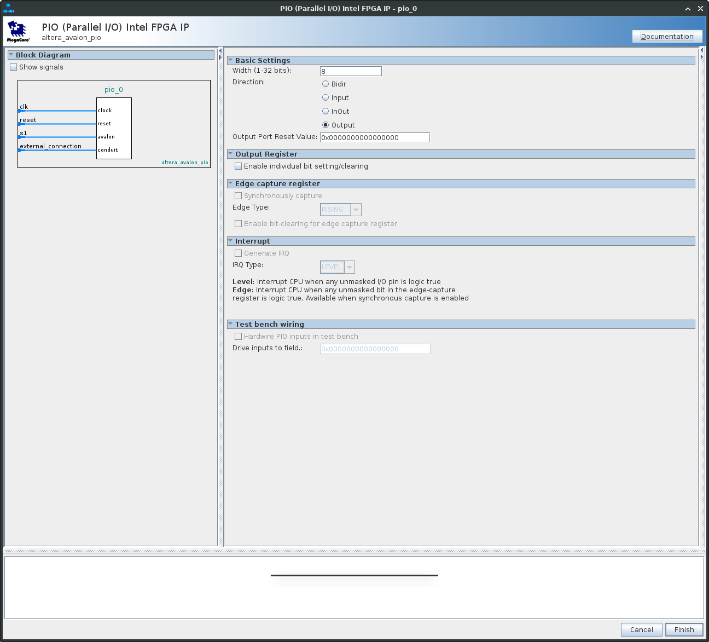
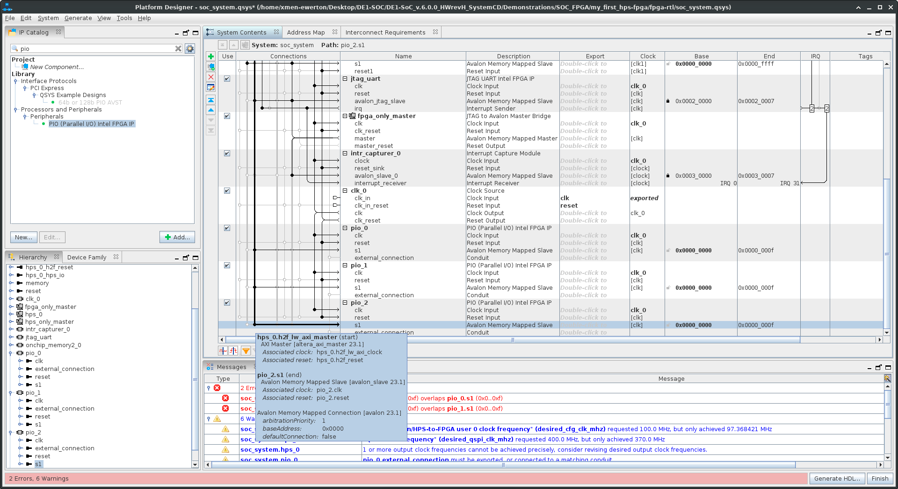
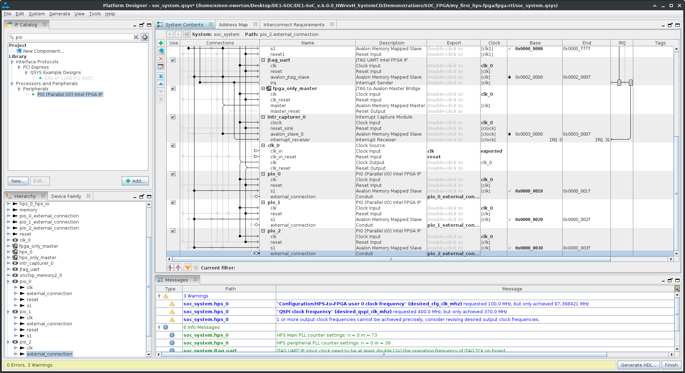

# Introdução

Esse material tem como objetivo orientar a implementação de uma comunicação HPS-FPGA utilizando a altera Cyclone V DE1-SOC. A ponte HPS-FPGA será utilizada para realizar a soma de dois números, com esses números sendo passados pelo HPS diretamente para a FPGA, que irá realizar a soma e retornar o resultado para o HPS.

Vale lembrar que o tutorial em questão não faz a cobertura de como configurar a placa para o modo linux, nem como organizar o ambiente. Também é importante avisar que é necessário possuir um conhecimento prévio sobre a linguagem de descrição de hardware SystemVerilog e a linguagem de programação C para melhor compreensão do tutorial.

Em anexo serão disponibilizados links para o auxilio da configuração da placa, tais como; manual da placa, exemplos fornecidos pela intel, etc. A principio, é desejável que seja realizado o download do CD-ROM disponibilizado no site da terasic, cujo link será disponibilizado no anexo.

O tutorial é dividido em duas partes: design de hardware e implementação de software. A sessão a seguir tratará do design do RTL.
# Design do Hardware

Com o CD-ROM baixado e descompactado, abra a pasta Demonstrations/SOC_FPGA/my_first_hps-fpga. Quando a\pasta estiver aberta será possível encontrar duas outras pastas; fpga-rtl e hps-c. Neste primeiro instante focaremos no fpga-rtl. O projeto em questão é um demonstração disponibilizado pela intel que objetiva praticar os conhecimentos da ponte HPS-FPGA. 

Após a abertura da pasta fpga-rtl abra o projeto no seu Quartus, e com o Quartus aberto faça a atualização de IPs que ele recomenda.

<div align="center">



 </div>

Após a finalização da atualização, abra o plataform desiner e o arquivo soc_system.qsys.

<div align="center">
	


 </div>

Com o arquivo aberto, clique no componente pio_led e exclua ele.



Com esses passos realizados, vá na barra de pesquisa do IP Catalog e procure por PIO(Parallel I/O) Intel FPGA IP e dê um clique duplo no IP, em Width escolha 8 bits e em direction selecione a opção Output. Clique em finish.



Repita esse processo outras duas vezes, mas no ultimo PIO selecione a opção input. Com todos os PIOs instanciados faça as conexões necessárias: clk em clk do clk_0, reset em clk_reset do clk_0 e s1 em h2f_lw_axi_master do hps_0.



Com todas as conexões realizadas, chegou a hora de alocar a memoria. Na área Base de cada PIO mude os valores para 0x0000_0010 em pio_0, 0x0000_0020 em pio_1 e 0x0000_0030 em pio_2. A disposição dos valores fica a critério do leitor, mas é recomendado sequencia-las para evitar problemas futuros.

Por ultimo, em cada PIO, clique com o botão direito na conexão do external_connection. Vá em connections: pio_0.external_connection e clique em Export as. 



Clique em Finish. Clique em Yes, quando questionado se deseja gerar o novo arquivo. Clique em generate e, logo após, clique em finish.

Quando o arquivo for gerado adicione o novo arquivo ao seu projeto do Quartus. Geralmente o arquivo pode ser encontrado em: soc_system/synthesis/soc_system.qip.

Com o arquivo de IPs pronto, está na hora de mudar a estrutura do seu projeto. Primeiro, crie variáveis para o seu somador e na instancia do seu soc_system faça as conexões necessárias para o seu novo design. O seu código deve ficar parecido com algo do gênero:

```
wire        hps_debug_reset;
wire [27:0] stm_hw_events;
logic [7:0] num1, num2, num3;
// connection of internal logics
//  assign LEDR = fpga_led_internal;
assign stm_hw_events    = {{3{1'b0}},SW, fpga_led_internal, fpga_debounced_buttons};


soc_system u0 (

    .pio_0_external_connection_export      (num1),
    .pio_1_external_connection_export      (num2),
    .pio_2_external_connection_export      (num3),
        
 	 
    .clk_clk                               (CLOCK_50),                               //                            clk.clk
    .reset_reset_n                         (hps_fpga_reset_n),                         //                          reset.reset_n
```

Com essas modificações prontas é necessário realizar a implementação do somador, que poderá ser implementado logo após a instancia u0.

```
    .hps_0_f2h_debug_reset_req_reset_n     (~hps_debug_reset),          //      hps_0_f2h_debug_reset_req.reset_n
    .hps_0_f2h_cold_reset_req_reset_n      (~hps_cold_reset)            //       hps_0_f2h_cold_reset_req.reset_n
);

assign num3 = num1 + num2;

// Source/Probe megawizard instance
hps_reset hps_reset_inst (
    .source_clk (CLOCK_50),
    .source     (hps_reset_req)
);
```

Faça a compilação do projeto e veja se haverá algum erro. Se não for o caso, apenas faça a transferência do projeto para a FPGA.

# Implementação de Software

Com a implementação do RTL finalizado, está na hora de começar a implementação do código em C. Abra a pasta hps-c. Você encontrará alguns arquivos, os que serão modificados serão: hps_0.h, main.c e Makefile. Primeiramente, vamos tratar do hps_0.h.

O hps_0.h é um arquivo de cabeçalho onde estão presentes todas as conexões necessárias para o código em C funcionar corretamente. Procure os macros para o 'pio_led' e faça as seguintes alterações:

```
#define PIO_0_COMPONENT_TYPE altera_avalon_pio
#define PIO_0_COMPONENT_NAME pio_0
#define PIO_0_BASE 0x10
#define PIO_0_SPAN 16
#define PIO_0_END 0x1f
#define PIO_0_BIT_CLEARING_EDGE_REGISTER 0
#define PIO_0_BIT_MODIFYING_OUTPUT_REGISTER 0
#define PIO_0_CAPTURE 0
#define PIO_0_DATA_WIDTH 8
#define PIO_0_DO_TEST_BENCH_WIRING 0
#define PIO_0_DRIVEN_SIM_VALUE 0
#define PIO_0_EDGE_TYPE NONE
#define PIO_0_FREQ 50000000
#define PIO_0_HAS_IN 0
#define PIO_0_HAS_OUT 1
#define PIO_0_HAS_TRI 0
#define PIO_0_IRQ_TYPE NONE
#define PIO_0_RESET_VALUE 255
```

Faça o mesmo com os demais PIO e deverá ter algo assim:

```
#define PIO_0_COMPONENT_TYPE altera_avalon_pio
#define PIO_0_COMPONENT_NAME pio_0
#define PIO_0_BASE 0x10
#define PIO_0_SPAN 16
#define PIO_0_END 0x1f
#define PIO_0_BIT_CLEARING_EDGE_REGISTER 0
#define PIO_0_BIT_MODIFYING_OUTPUT_REGISTER 0
#define PIO_0_CAPTURE 0
#define PIO_0_DATA_WIDTH 8
#define PIO_0_DO_TEST_BENCH_WIRING 0
#define PIO_0_DRIVEN_SIM_VALUE 0
#define PIO_0_EDGE_TYPE NONE
#define PIO_0_FREQ 50000000
#define PIO_0_HAS_IN 0
#define PIO_0_HAS_OUT 1
#define PIO_0_HAS_TRI 0
#define PIO_0_IRQ_TYPE NONE
#define PIO_0_RESET_VALUE 255

#define PIO_1_COMPONENT_TYPE altera_avalon_pio
#define PIO_1_COMPONENT_NAME pio_1
#define PIO_1_BASE 0x20
#define PIO_1_SPAN 16
#define PIO_1_END 0x2f
#define PIO_1_BIT_CLEARING_EDGE_REGISTER 0
#define PIO_1_BIT_MODIFYING_OUTPUT_REGISTER 0
#define PIO_1_CAPTURE 0
#define PIO_1_DATA_WIDTH 8
#define PIO_1_DO_TEST_BENCH_WIRING 0
#define PIO_1_DRIVEN_SIM_VALUE 0
#define PIO_1_EDGE_TYPE NONE
#define PIO_1_FREQ 50000000
#define PIO_1_HAS_IN 0
#define PIO_1_HAS_OUT 1
#define PIO_1_HAS_TRI 0
#define PIO_1_IRQ_TYPE NONE
#define PIO_1_RESET_VALUE 255

#define PIO_2_COMPONENT_TYPE altera_avalon_pio
#define PIO_2_COMPONENT_NAME pio_2
#define PIO_2_BASE 0x30
#define PIO_2_SPAN 16
#define PIO_2_END 0x3f
#define PIO_2_BIT_CLEARING_EDGE_REGISTER 0
#define PIO_2_BIT_MODIFYING_OUTPUT_REGISTER 0
#define PIO_2_CAPTURE 0
#define PIO_2_DATA_WIDTH 8
#define PIO_2_DO_TEST_BENCH_WIRING 0
#define PIO_2_DRIVEN_SIM_VALUE 0
#define PIO_2_EDGE_TYPE NONE
#define PIO_2_FREQ 50000000
#define PIO_2_HAS_IN 0
#define PIO_2_HAS_OUT 1
#define PIO_2_HAS_TRI 0
#define PIO_2_IRQ_TYPE NONE
#define PIO_2_RESET_VALUE 0

```

Com isso é possível ir para o arquivo main.c.

No main.c será necessário apagar tudo relacionado ao pio_led e substituir por variáveis necessárias para o funcionamento do somador, tais como os ponteiros e seus valores. Ao final desse processo, o seu código deverá ter algo parecido com o código abaixo:

```
#include <stdio.h>
#include <unistd.h>
#include <fcntl.h>
#include <sys/mman.h>
#include "hwlib.h"
#include "soc_cv_av/socal/socal.h"
#include "soc_cv_av/socal/hps.h"
#include "soc_cv_av/socal/alt_gpio.h"
#include "hps_0.h"
  
#define HW_REGS_BASE ( ALT_STM_OFST )
#define HW_REGS_SPAN ( 0x04000000 )
#define HW_REGS_MASK ( HW_REGS_SPAN - 1 )

#define ALT_AXI_FPGASLVS_OFST (0xC0000000) // axi_master
#define HW_FPGA_AXI_SPAN (0x40000000) // Bridge span 1GB
#define HW_FPGA_AXI_MASK ( HW_FPGA_AXI_SPAN - 1 )

int main() {

	void *virtual_base;
	int fd;
	void *num1;
	void *num2;
	void *num3;
	
	//mapeando os endereços
	if( ( fd = open( "/dev/mem", ( O_RDWR | O_SYNC ) ) ) == -1 ) {
		printf( "ERROR: could not open \"/dev/mem\"...\n" );
		return( 1 );
	}

	virtual_base = mmap( NULL, HW_REGS_SPAN, ( PROT_READ | PROT_WRITE ), MAP_SHARED, fd, HW_REGS_BASE );

	if( virtual_base == MAP_FAILED ) {
		printf( "ERROR: mmap() failed...\n" );
		close( fd );
		return( 1 );
	}

    axi_virtual_base = mmap( NULL, HW_FPGA_AXI_SPAN, ( PROT_READ | PROT_WRITE ), MAP_SHARED, fd,ALT_AXI_FPGASLVS_OFST );

    if( axi_virtual_base == MAP_FAILED ) {
        printf( "ERROR: axi mmap() failed...\n" );
        close( fd );
        return( 1 );
    }

	num1 =virtual_base + ( ( unsigned long  )( ALT_LWFPGASLVS_OFST + PIO_0_BASE ) & ( unsigned long)( HW_REGS_MASK ) ); //instanciando num1
	num2 =virtual_base + ( ( unsigned long  )( ALT_LWFPGASLVS_OFST + PIO_1_BASE ) & ( unsigned long)( HW_REGS_MASK ) ); //instanciando num2
	num3 =virtual_base + ( ( unsigned long  )( ALT_LWFPGASLVS_OFST + PIO_2_BASE ) & ( unsigned long)( HW_REGS_MASK ) ); //instanciando num3


	*(uint8_t *)num1 = 3; //definindo valores para num1
	*(uint8_t *)num2 = 2; //definindo valores para num2
 
	//lendo o resultado e printando
	printf( "Adder result:%d + %d = %d\n", *((uint8_t *)num1), *((uint8_t *)num2), *((uint8_t *)num3) );

	// limpando o mapa de memoria
	
	if( munmap( virtual_base, HW_REGS_SPAN ) != 0 ) {
		printf( "ERROR: munmap() failed...\n" );
		close( fd );
		return( 1 );
	}

	close( fd );

	return( 0 );
}
```

Por ultimo, é necessario alterar o makefile existente para o seguinte

```
TARGET = my_first_hps-fpga

ALT_DEVICE_FAMILY = soc_cv_av
SOCEDS_ROOT = /intelFPGA/18.1/embedded
HWLIBS_ROOT = $(SOCEDS_ROOT)/ip/altera/hps/altera_hps/hwlib

SOCEDS_DEST_ROOT=/intelFPGA/18.1/embedded/ip/altera/hps/altera_hps/hwlib
IP_DEST_ROOT=/intelFPGA/18.1/embedded

HWLIBS_SRC  := ${SOCEDS_DEST_ROOT}/src/hwmgr/alt_dma.o ${SOCEDS_DEST_ROOT}/src/hwmgr/alt_dma_program.o ${SOCEDS_DEST_ROOT}/src/hwmgr/alt_globaltmr.o

CROSS_COMPILE = arm-linux-gnueabihf-

CFLAGS = -static -g -Wall -std=c99 -D_POSIX_C_SOURCE=199309L -I${SOCEDS_DEST_ROOT}/include -I$(HWLIBS_ROOT)/include -I$(HWLIBS_ROOT)/include/$(ALT_DEVICE_FAMILY) -I${SOCEDS_ROOT}/examples/hardware/cv_soc_devkit_ghrd/software/preloader/uboot-socfpga/arch/arm/include/ -D$(ALT_DEVICE_FAMILY)

  

LDFLAGS =  -g -Wall  
CC = $(CROSS_COMPILE)gcc
ARCH= arm
  
all: $(TARGET)
$(TARGET): main.o $(HWLIBS_SRC)
    $(CC) $(LDFLAGS)   $^ -o $@  
%.o : %.c
    $(CC) $(CFLAGS) -c $< -o $@
.PHONY: clean

clean:
    rm -f $(TARGET) *.a *.o *~
```

Lembre-se de alterar os diretórios do makefile, se necessário.

Para poder compilar o makefile no windows procure a seguinte pasta C:/intelFPGA/18.1/embedded e dê um clique duplo em embedded_command_shell.bat. Em seguida, procure o diretório que o seu main.c está e digite make.

Com isso, será gerado um arquivo binário chamado "my_first_hps-fpga". Transfira o arquivo binário para o seu SOC e execute o programa. Caso tudo tenha saído como o planejado, a saída do programa deverá ser a seguinte.

```
root@de1soclinux:~/Desktop# ./my_first_hps-fpga
Adder result: 3 + 2 = 5
```
Com isso, você está capacitado a fazer implementações utilizando a ponte HPS-FPGA. Vale lembrar que isso é apenas um simples exemplo, mas ele abre porta para vários projetos com uma complexidade bem maior.

